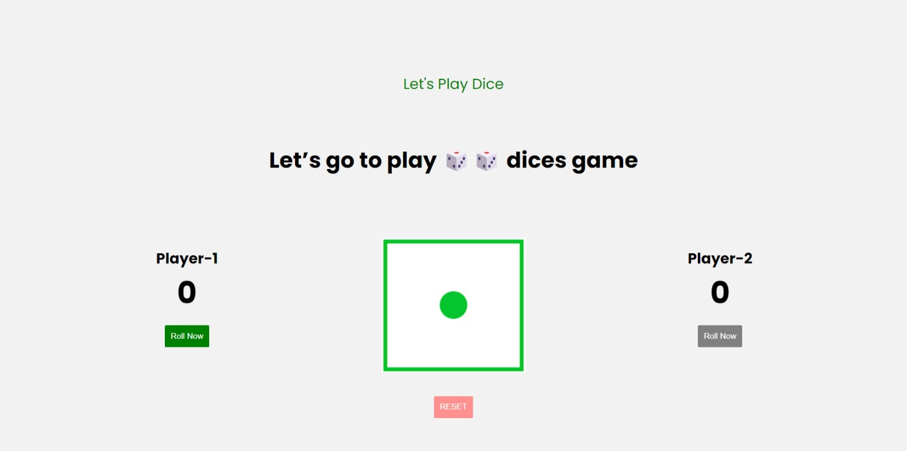

# Dice Game Website

## Description

This is a simple web-based dice game created for the Guvi web development task. The game allows two players to take turns rolling a virtual dice and keeping track of their scores. The first player to reach a predefined winning score is declared the winner.

## Features

Two players can participate.
Roll the dice to accumulate scores.
Interactive interface with animations.
Congratulatory messages for winners.
Reset button to start a new game.

## Screenshots

Include screenshots or GIFs of your game in action to provide a visual representation of the game.

## Screenshots

## Getting Started

### Prerequisites

To run the dice game website locally, you need:

A web browser (e.g., Chrome, Firefox).

## Installation

Clone this repository to your local machine:(https://github.com/Godson2611/Dice-Game.git)

Navigate to the project directory link:(https://dice-game-pages.netlify.app/)

Open the index.html file in your preferred web browser.

## Usage

Click the "Roll" button to roll the dice.

The dice image will change, and your score will be updated.

Play alternates between Player 1 and Player 2.

The first player to reach the winning score wins.

Use the "Reset" button to start a new game.

## Game Rules

Each player takes turns rolling the dice.

The number rolled on the dice is added to the player's score.

The game continues until one player reaches the winning score (usually 30).

## Technologies Used
HTML
CSS
JavaScript

## Contributing
Contributions are welcome! If you'd like to improve the game or fix any issues, please open an issue or create a pull request.